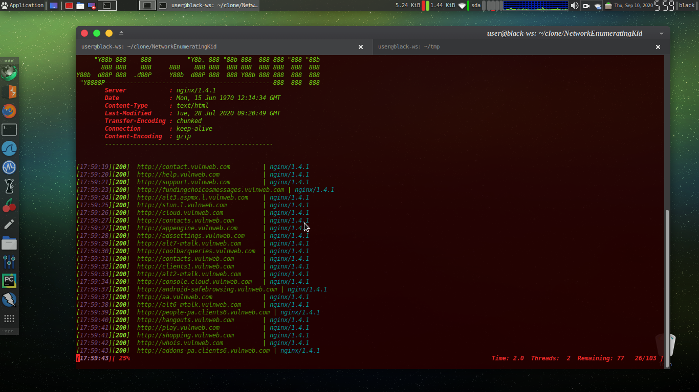

# NetworkEnumeratingKid

Network Enumerating toolkid for subdomain enumeration

# 
* written in Python3 

* sumdomain Enumeration
* Directory broutforcing
* Banner Graphy
* Method deduction
* Spidering
* and next willbe updated soon

# Installation

           clone the repo and execute directly.Be sure you have already install Python (verssion > 3). 
           If don't then Install,
           
           Exmpl for deBased distro
           ~$ sudo apt install python
           or
           ~# apt install python

# Run

> $ ./n3tool --help

